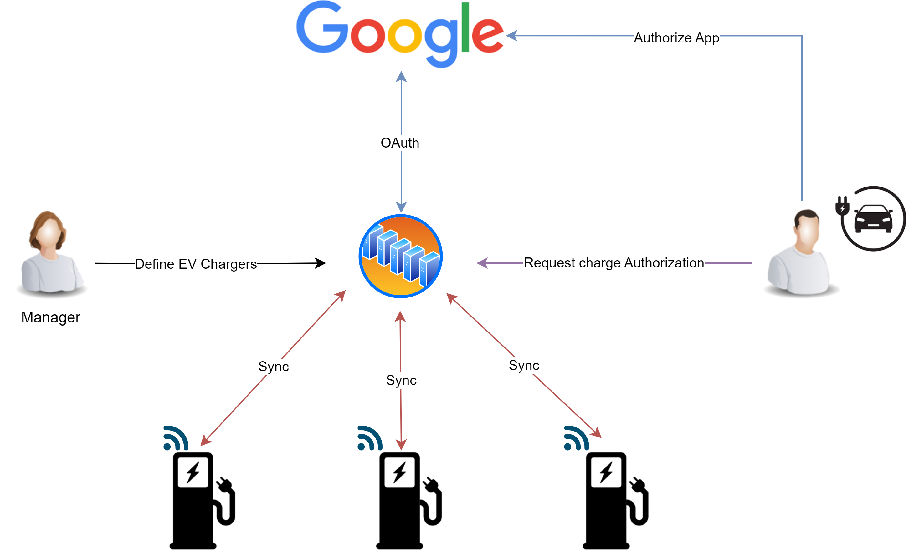
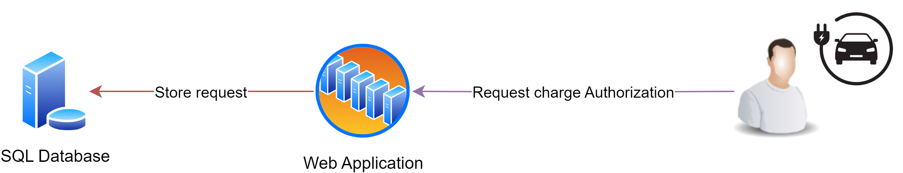
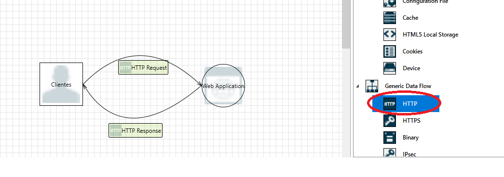

# Threat Modeling LAB

## Storyline

Trabajamos para una StartUp que se dedica al despliegue de cargadores para vehículos eléctricos en la ciudad. Para ello, está diseñando una aplicación web que permitirá a los usuarios acceder a un mapa con todos los puntos de recarga y activar el cargador de forma remota bajo demanda. 

A continuación se muestra un esquema del sistema propuesto

Nos han pedido hacer un análisis de amenazas `Threat Modeling` utilizando el modelo `STRIDE`. Para acotar el problema, nos centraremos en la interacción del usuario con el servicio web y el almacenamiento en una base de datos SQLServer. Tal y como se muestra a continuación

## Requisitos

Utilizaremos la herramienta [Microsoft Threat Modeling Tool](https://learn.microsoft.com/en-us/azure/security/develop/threat-modeling-tool). La podemos descargar en la web oficial en el siguiente enlace: (https://aka.ms/threatmodelingtool).

## Lab

1- Abriremos la herramienta de modelado de Amenazas y crearemos un proyecto nuevo. Utilizaremos la plantilla de modelos `SDL TM Knowledge Base (Core)`

2- Añadiremos el recurso `Web Application` a nuestro proyecto. Este representará la aplicación web que dará servicio a los usuarios.

3- A continuación, añadiremos el objeto `Human User`, que representará los clientes que interactuaran con esta aplicación web. Cambiaremos el nombre del objeto por `Clientes` para mayor claridad.

4- Definiremos los flujos de datos entre los clientes y la aplicación web, estos serán del tipo `HTTP`. Un flujo de `request` de cliente a la aplicación web y el flujo contrario de respuesta, tal y como se muestra a continuación

5- Si no indicamos lo contrario, la herramienta presupondrá que todos los componentes del modelo residen en el mismo dominio. En este caso concreto, tendremos que indicarle que el tráfico entre el cliente y la aplicación web pasará por internet. Esta característica la definiremos dibujando una línea `internet boundary`, que cruzará el flujo definido anteriormente

6- En este punto, ya tenemos una primera iteración del modelo. Lo analizaremos para revisar las amenazas que detecta la herramienta, que deberían de ser 13

7- Si nos fijamos, hay una amenaza relacionada con la utilización de un canal de datos no seguro entre el cliente y la aplicación Web (`Data Flow Sniffing`). Modificaremos el modelo, substituyendo las conexiones `HTTP` por `HTTPS` y volveremos a analizar el modelo

