# Threat Modeling LAB

## Storyline

Trabajamos para una StartUp que se dedica al despliegue de cargadores para vehículos eléctricos en la ciudad. Para ello, está diseñando una aplicación web que permitirá a los usuarios acceder a un mapa con todos los puntos de recarga y activar el cargador de forma remota bajo demanda. 

A continuación se muestra un esquema del sistema propuesto

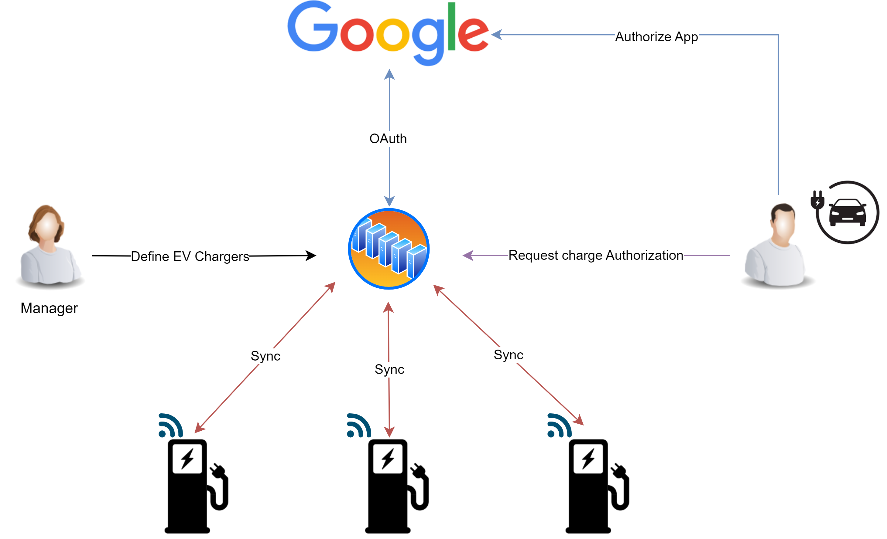

Nos han pedido hacer un análisis de amenazas `Threat Modeling` utilizando el modelo `STRIDE`. Para acotar el problema, nos centraremos en la interacción del usuario con el servicio web y el almacenamiento en una base de datos SQLServer. Tal y como se muestra a continuación

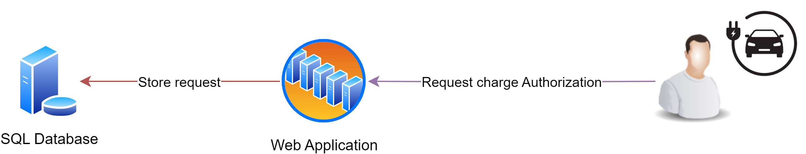

## Requisitos

Utilizaremos la herramienta [Microsoft Threat Modeling Tool](https://learn.microsoft.com/en-us/azure/security/develop/threat-modeling-tool). La podemos descargar en la web oficial en el siguiente enlace: (https://aka.ms/threatmodelingtool).

## Lab

1- Abriremos la herramienta de modelado de Amenazas y crearemos un proyecto nuevo. Utilizaremos la plantilla de modelos `SDL TM Knowledge Base (Core)`

2- Añadiremos el recurso `Web Application` a nuestro proyecto. Este representará la aplicación web que dará servicio a los usuarios.
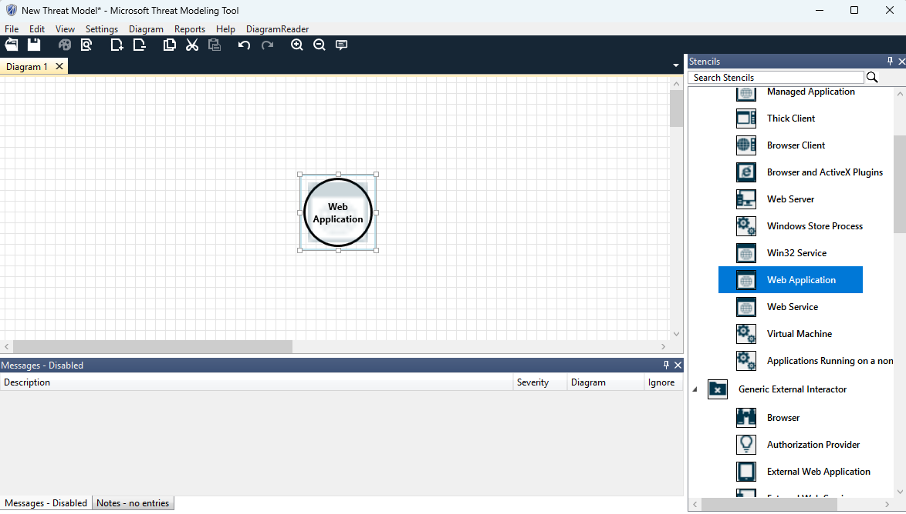

3- A continuación, añadiremos el objeto `Human User`, que representará los clientes que interactuaran con esta aplicación web. Cambiaremos el nombre del objeto por `Clientes` para mayor claridad.

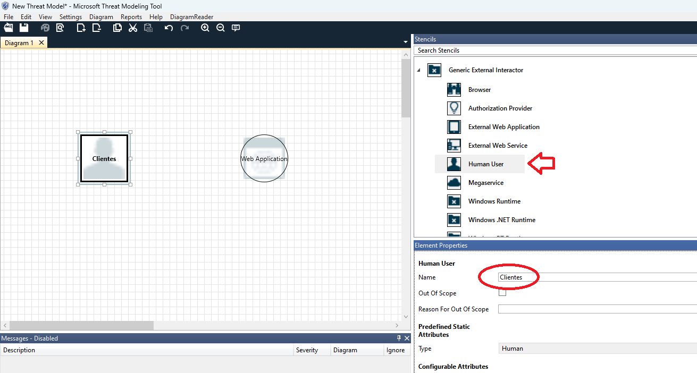

4- Definiremos los flujos de datos entre los clientes y la aplicación web, estos serán del tipo `HTTP`. Un flujo de `request` de cliente a la aplicación web y el flujo contrario de respuesta, tal y como se muestra a continuación

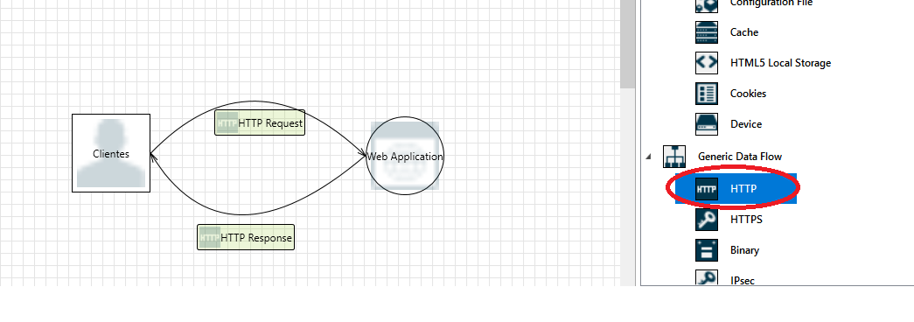

5- Si no indicamos lo contrario, la herramienta presupondrá que todos los componentes del modelo residen en el mismo dominio. En este caso concreto, tendremos que indicarle que el tráfico entre el cliente y la aplicación web pasará por internet. Esta característica la definiremos dibujando una línea `internet boundary`, que cruzará el flujo definido anteriormente

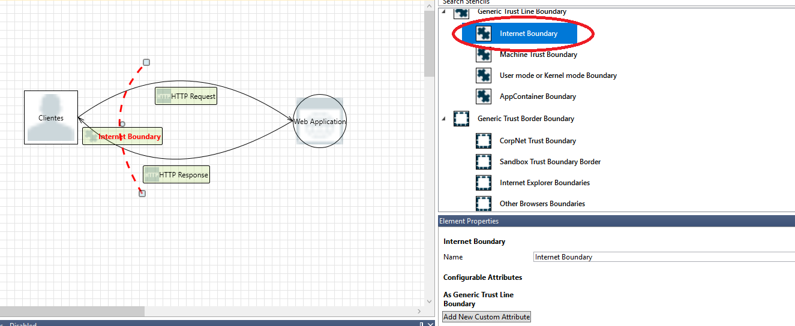

6- En este punto, ya tenemos una primera iteración del modelo. Lo analizaremos para revisar las amenazas que detecta la herramienta, que deberían de ser 13

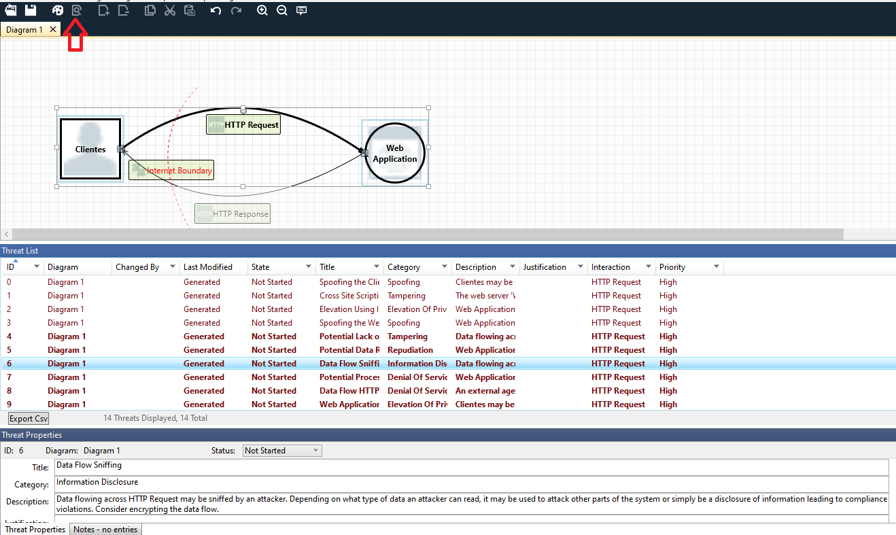

7- Si nos fijamos, hay una amenaza relacionada con la utilización de un canal de datos no seguro entre el cliente y la aplicación Web (`Data Flow Sniffing`). Modificaremos el modelo, substituyendo las conexiones `HTTP` por `HTTPS` y volveremos a analizar el modelo

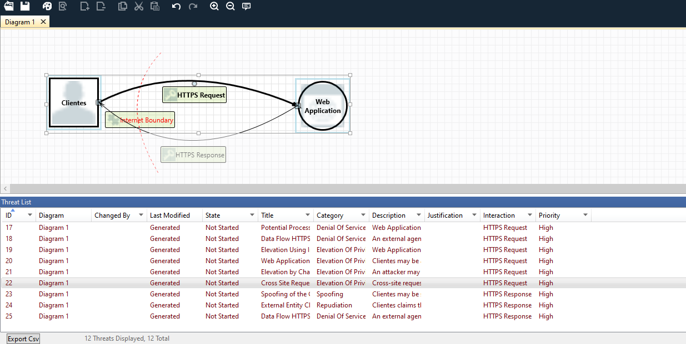

8- El siguiente paso es incluir la conexión con la base de datos SQL. La utilizaremos para almacenar el estado de la aplicación: usuarios, peticiones de carga, registros de cargadores... etc.

Añadiremos los siguientes atributos acorde a nuestro caso de uso:
- Stores Credentials (Yes)
- Stores Log Data (Yes)
- Encrypted (Yes)
- Write Access (Yes)
- Backup (Yes)

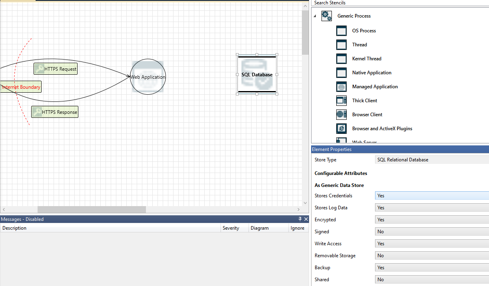

9- Conectaremos la base de datos con la aplicación web, utilizando una conexión `Generic Data Flow`, que representa un canal cifrado y autenticado mediante SSL, en la implementación real se utilizará `TLS`.

Modificaremos los atributos de las conexiones con las características propias de una conexión TLS a una base de datos

- Destination Authenticated (Yes)
- Provides Confidenciality (Yes)
- Provides Integrity (Yes)

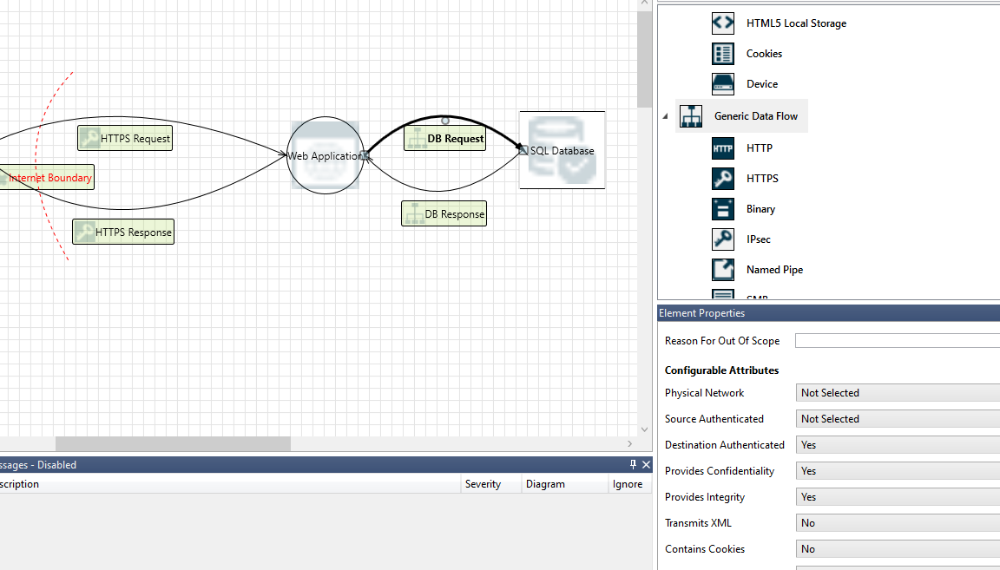

10- Analiza el modelo y revisa las amenazas que ha detectado la herramienta. ¿Crees que todas son aplicables a nuestro caso de uso?
En nuestro caso, marcaremos la amenaza `Cross Site Scripting` como mitigada, ya que estamos utilizando un framework web que sanitiza los datos antes de imprimirlos

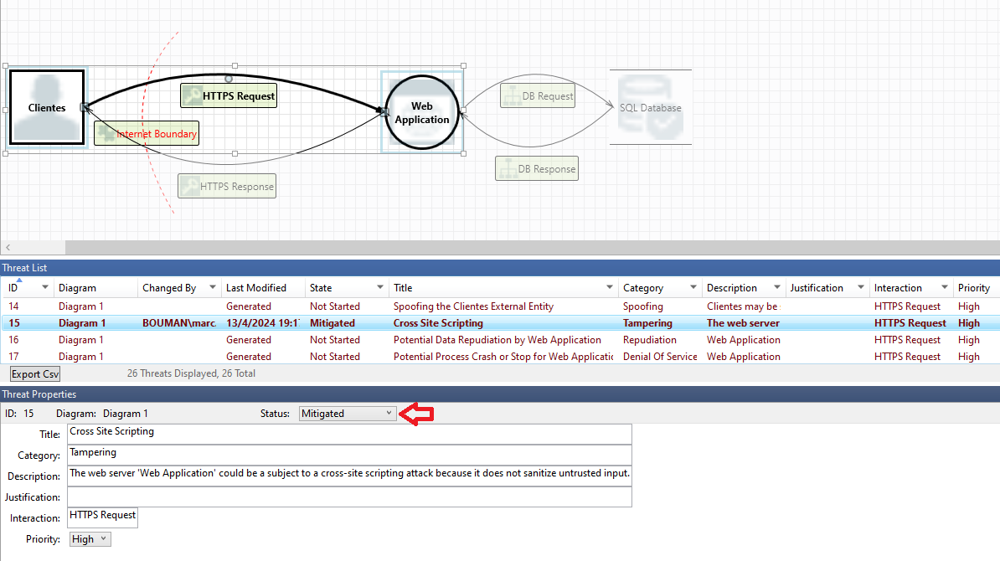

11- Genera un report completo del modelo que hemos dibujado y observa el informe generado. ¿Qué información incluye?

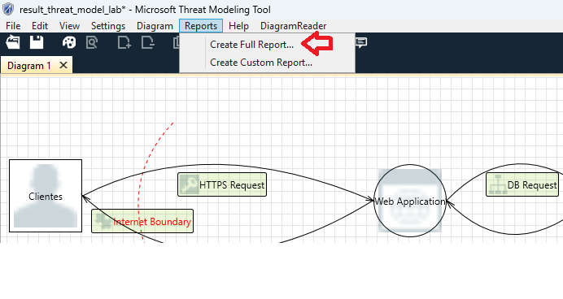

### Opcional

12- Queremos que nuestra aplicación permita a los usuarios hacer login con Google vía OAuth2.0 utilizando el flujo `Authorization Code Grant` y acceder a su información en la nube. Buscar información sobre este flujo e introduce los cambios necesarios en el modelo para incluir esta funcionalidad

Hint

A continuación se muestra una propuesta. Por una parte el cliente deberá acceder al proveedor para autorizar la aplicación, y por otra, la aplicación web tendrá que acceder al servicio para pedir el token y acceder a la información del usuario.

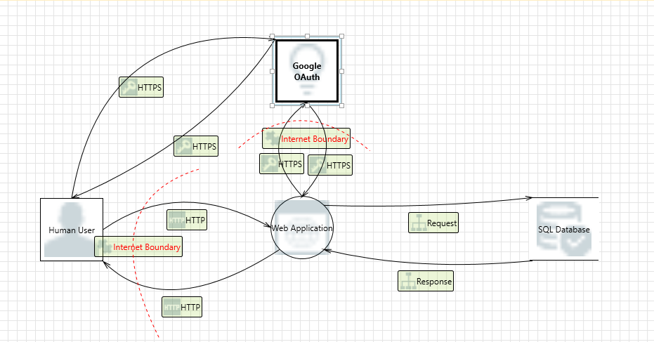

